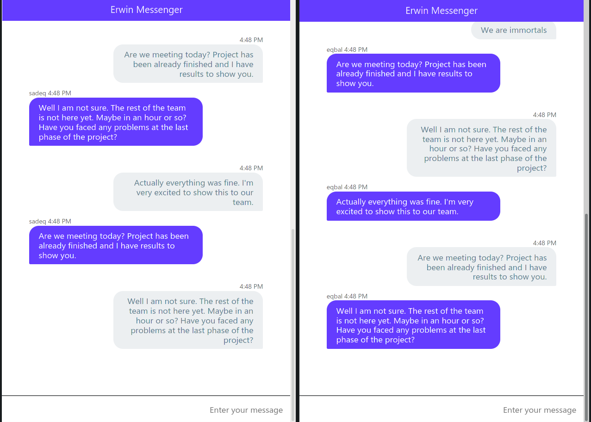

**Erwin** is minimal open-source messenger that implemented with Flask Framework and Socket programming with python


## Table of contents
* [Run](#How-to-Run)
* [Doc](#Document-of-Server-Program)
* [License](#License)

## How to Run
you can use this command to install requirements:
```bash 
$ pip install -r requirements.txt
```

We have two Program. server and client
* server

To run server program go to the **./Server** directory in the root of project and use this command:
```bash
$ cd ./Server
$ python Server.py -h 
usage: server [-h] [-ip ip] [-p [1-65535]]

optional arguments:
  -h, --help    show this help message and exit
  -ip ip        Set Server IP Address (default: 127.0.0.1)
  -p [1-65535]  Set Server Port Number (default: 30008)

# or simply use 
$ python Server.py

```

* client

For implementation of Client application we use Flask framework, so you can use Flask command to run it
> noraml

To Run client application in Development mode you shoud set some global variable in your machine for Flask framework.
change diractory to **./Client** then following below command 
```shell
$ cd ./Client
$ export FLASK_APP=GClient.py
$ export FLASK_ENV=deployment
$ python3 -m flask run -p 3000
# you can simply changing port number. in this example is 30000
```

then open the browser and joy!

> shell script

Also i write a bash script to simply run application.
chagne directory to **./Client** and run bash script file
```bash
$ cd ./Client
$ ./run.sh
output:
 * Serving Flask app 'GClient.py' (lazy loading)
 * Environment: deployment
 * Debug mode: off
...:  * Running on http://127.0.0.1:30000/ (Press CTRL+C to quit)
```
If you want run another client on your machine you can simply change the port number in **run.sh** file.

### Document 
#### Sub Module
* [argparse](https://docs.python.org/3/library/argparse.html)
The argparse module makes it easy to write user-friendly command-line interfaces. The program defines what arguments it requires, and argparse will figure out how to parse those out of sys.argv. The argparse module also automatically generates help and usage messages and issues errors when users give the program invalid arguments.

```python
# Server.py
import argparse as arg 

def argumentPars():
    parser = arg.ArgumentParser(prog='server', add_help=True)

    parser.add_argument("-ip", help="Set Server IP Address (default: 127.0.0.1)", type=str)

    parser.add_argument("-p", help="Set Server Port Number (default: 30008)", type=str)

    args = parser.parse_args()

    if(args.sip == None and args.sp != None):
        return args.sp, "127.0.0.1"
    elif(args.sp == None and args.sip != None):
        return 30008, args.sip
    elif(args.sp == None and args.sip == None):
        return 30008, "127.0.0.1"

    return args.sp, args.sip

```

* [logging](https://docs.python.org/3/howto/logging.html)
Logging is a means of tracking events that happen when some software runs. The software’s developer adds logging calls to their code to indicate that certain events have occurred. An event is described by a descriptive message which can optionally contain variable data (i.e. data that is potentially different for each occurrence of the event). Events also have an importance which the developer ascribes to the event; the importance can also be called the level or severity.

```python
# ./Log/logger.py
import logging

format = "%(asctime)s: %(message)s" 
logging.basicConfig(format=format, level=logging.INFO, datefmt="%H:%M:%S")

def warn(msg):
    logging.warn(msg)

def info(msg):
    logging.info(msg)
    
# Server.py
import Log.logger as logger 
logger.warn(msg)
```
and other submodule that i use:
* [SocketServer](./Server/SocketServer.py)

[threading](https://docs.python.org/3/library/threading.html)


* [Protobuf](https://github.com/protocolbuffers/protobuf/tree/master/python)
    * [Totuiral](https://developers.google.com/protocol-buffers/docs/pythontutorial)

command for compile the protoc:
```bash
$ cd ./protoc
$ protoc --python_out=./test ./Server.proto 
```

## License

MIT 2021